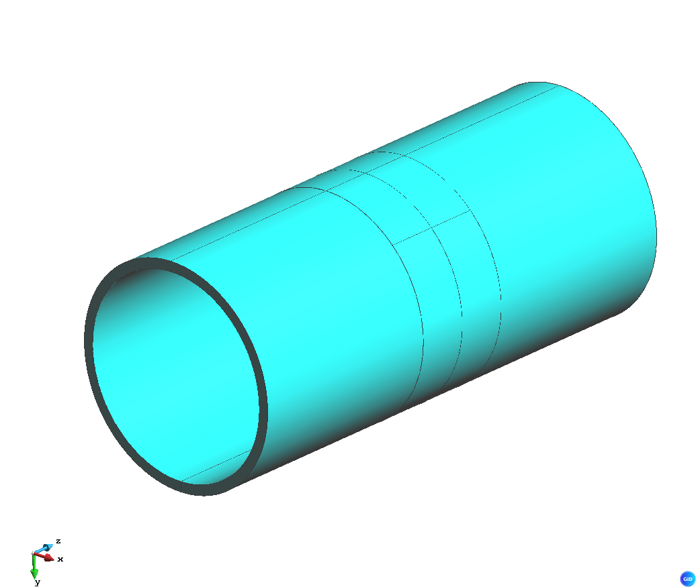
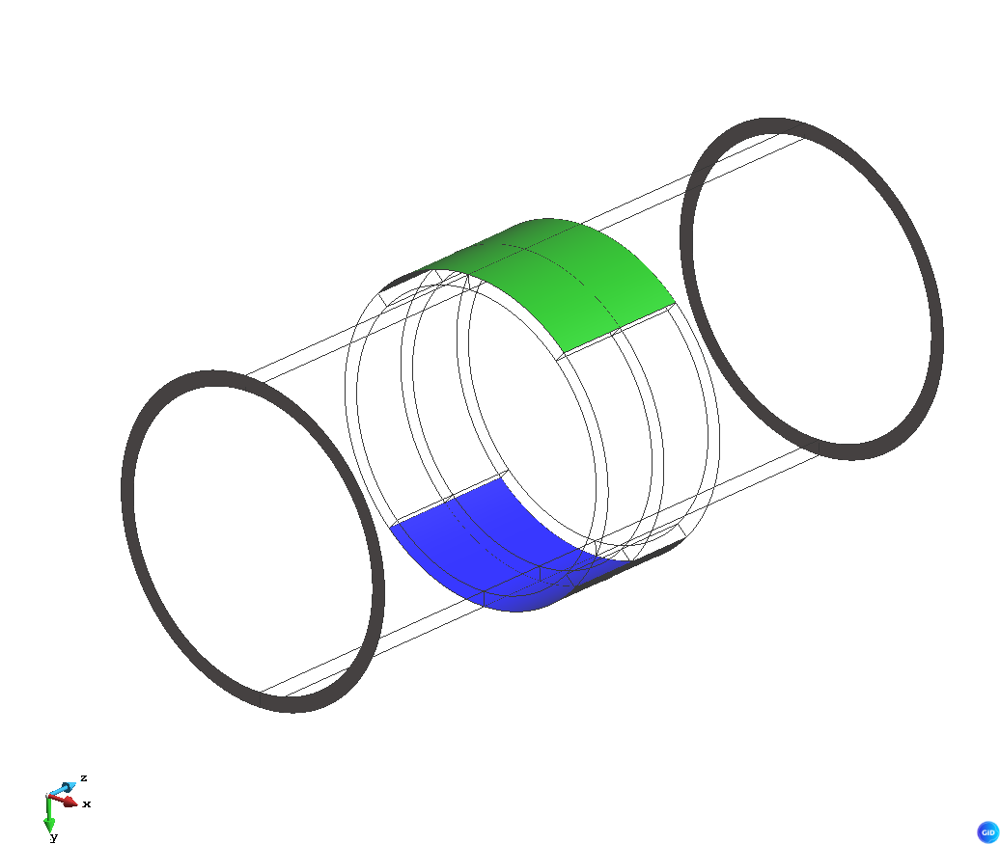
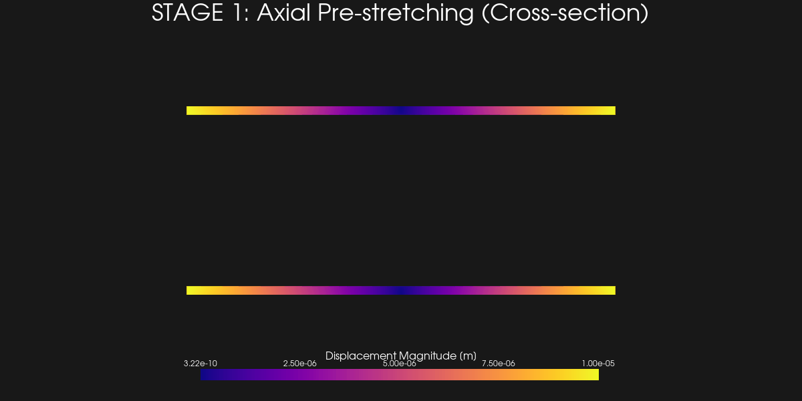

# INNOVECMO Benchmarks

This repository serves as a collection of benchmarks and problems for the **INNOVECMO** project. The project focuses on the development and validation of an innovative, valveless, wave-driven pumping concept (Liebau-based pump) for Extracorporeal Membrane Oxygenation (ECMO) systems.

## Project Overview

The INNOVECMO project aims to provide a viable alternative to current rotary (centrifugal) ECMO pumps. By leveraging the Liebau principle—where periodic external compression of a compliant tube generates net directional flow—the project seeks to restore physiologically relevant pulsatility while minimizing blood damage (hemolysis and thrombogenesis) associated with high-shear rotary blades.

### Simulation Roadmap
The project follows a hierarchical, multi-stage strategy to ensure numerical robustness and scientific validation:

1.  **Phase I: Structural Truth (Empty Prestressed Tube)**
    - **Status**: [FOM Scripts Ready]
    - Reproduce large-deformation behavior and contact patterns of the empty silicone tube.
    - **Implementation**: Multi-stage Python script (`MainKratos_FOM.py`) handles axial stretching (0-1s) followed by vertical pinching (1-2s).
    - **Symmetric Boundary Conditions**: The model applies a symmetric axial pull of $\pm 1$ mm ($2$ mm total stretch) to maintain the central section at $Z=0$ for improved stability and visualization.
    - **Pre-stress Rationale**: An axial pre-strain of **$2\%$** is applied to emulate real-world clinical assembly. This ensures the compliant tube remains taut, preventing structural buckling during high-frequency actuation and shifting the system's resonant response to the target clinical range.
    - **Validation**: Compare against experimental segmented contours.


*Initial Solid geometry and Model Parts for the compliant tube.*


*Definition of End Boundaries and Pinching Zones (Top/Bottom).*


*Animation of the two-stage structural response. Stage 1 (0-1s): Symmetric Axial stretching. Stage 2 (1-2s): Vertical pinching. Colormap represents displacement magnitude with dynamic scaling for maximum detail.*


*Premium Technical Section: Side-view animation with internal displacement gradients (plasma colormap) and high-contrast boundary definition for experimental validation.*
2.  **Phase II: Projection-based Structural ROM**
    - Construct a reduced-order model (ROM) to compress the structural response manifold.
    - Accelerates the generation of training data for subsequent stages.
3.  **Phase III: Manifold Reduced Model (M-ROM)**
    - Capture the nonlinear solution manifold for efficient design exploration and real-time control.
4.  **Phase IV: Coupling with 1D Hemodynamic Fluid Model**
    - Use a 1D wave-propagation model (Kratos) to solve for pressure and flow.
    - **Coupling variable**: Local cross-sectional area evolution.
    - **Objective**: Capture system-level wave dynamics and interference while maintaining geometric richness in the actuation zone.
5.  **Phase V: Methodological Local FSI**
    - High-fidelity 3D FSI simulations used as a validation centerpiece for the reduced-order pipeline.


## Software Ecosystem

| Tool | Primary Role |
|------|--------------|
| **Kratos Multiphysics** | **Core Development**: Main environment for structural FOM, ROM training, and 1-D fluid coupling. |
| **MATLAB** | **Joaquín's Environment**: Used for rapid prototyping, material property testing, and analytical verification. |

## Getting Started

This benchmark is designed to be portable and easy to run. You can install the structural solver directly via PyPI.

### 1. Installation
Install the core Kratos Multiphysics environment:
```bash
pip install KratosMultiphysics
```
For more details, visit the [Kratos PyPI page](https://pypi.org/project/KratosMultiphysics/).

### 2. Running the Benchmark
Navigate to the Phase I directory and run the main simulation script:
```bash
cd Benchmarks/Stage1_Structural/
python3 MainKratos_FOM.py
```
This will generate the results in the `vtk_output` folder (if not ignored) or you can use the built-in visualization tools to inspect the deformation.

## Modeling Philosophy: Multifidelity Pipeline

1.  **Reference Truth**: High-fidelity FEM simulations establish physical trust.
2.  **Compressed Reality**: ROMs transfer this truth into a computationally efficient environment.
3.  **Design Speed**: Manifold surrogates enable rapid evaluation and optimization of flow rates and hemolysis risk.

## Clinical Benchmarks

| Parameter | Representative Range / Limit |
|-----------|------------------------------|
| Adult Flow Rate | 2 – 7 L/min |
| Pressure Rise (Head) | 200 – 300 mmHg |
| Venous Suction Limit | -70 mmHg (Alarm threshold) |
| Arterial Return Limit | 400 mmHg (Alarm threshold) |
| Cannula Diameter | 15-17 Fr (Arterial), 21-24 Fr (Venous) |
| Circuit Volume | ~0.5 L (priming volume) |

## Technical Parameters

The following parameters are established based on the experimental configurations described in the reference papers (Rubio et al., 2025/2026) and the project email:

### Compliant Tube (Silicon/Latex/Rubber)
| Parameter | Value |
|-----------|-------|
| Diameter ($d_{ct}$) | 20 mm |
| Length ($l_{ct}$) | 100 mm |
| Thickness ($t$) | ~2 mm |
| Pre-strain ($\epsilon_{axial}$) | 2% (Implemented symmetrically as $\pm 1$ mm) |
| Young's Modulus ($E$) | 1.1026 MPa |
| Poisson's Ratio ($\nu$) | 0.45 (Stable almost-incompressible limit) |
| Shear Modulus ($G$) | 0.38 MPa |
| Density ($\rho$) | 1040 kg/m³ |

### Actuation & Circuit
| Parameter | Value |
|-----------|-------|
| Actuator Width | 20 mm |
| Actuator Position ($\beta$) | 0.5 (Midpoint) |
| Length Ratio ($\lambda$) | $l_l / l_s \approx 4.5$ (Optimal) |
| Rigid Pipe Diameter ($d_{rt}$) | 16 - 20 mm |

## Resonant Pumping Physics

The system's performance is governed by the interaction of pressure waves and structural compliance. Key metrics used for benchmarking include:

### 1. Womersley Number ($Wo^2$)
Evaluates the importance of viscous effects relative to oscillatory inertia:

$$Wo^2 = \frac{d_{rt}^2 \sqrt{\rho P_b}}{\mu l_l}$$

*   **High $Wo^2 (> 80)$**: Viscous effects are subdominant; semi-empirical models are accurate.
*   **Low $Wo^2 (< 20)$**: Viscous effects significantly reduce net flow.

### 2. Ideal Resonant Period ($T_{ic}$)
The theoretical period at which the system achieves maximum stroke efficiency:

$$T_{ic} = \sqrt{\frac{2 V_{ct} l_s}{A_{rt} g h}}$$

### 3. Maximum Net Flow Rate ($Q_{ic}$)
Theoretical upper limit of directional flow generated by Liebau resonance:

$$Q_{ic} = \sqrt{\frac{V_{ct} A_{rt} g h}{8 l_s}}$$

---

## Benchmark Replication Guide — Phase I Structural Case

> **Purpose**: This section is a self-contained recipe to reproduce the Kratos FOM results in any other finite-element solver (Abaqus, COMSOL, FEniCS, etc.), including a quasi-static variant. No Python knowledge is required; every number and surface name is spelled out explicitly.

---

### 1. Obtaining the Mesh (GID Project)

The pre-meshed geometry is stored in this repository under:

```
Tube_Phase1_Structural.gid/
```

The file you need to import the mesh into your solver is:

```
Tube_Phase1_Structural.gid/Tube_Phase1_Structural.mdpa
```

This is a plain-text file in the **Kratos MDPA format**. It contains:
- All nodal coordinates (3D, units: **metres**).
- All tetrahedral elements (4-node linear tetrahedra, `TotalLagrangianElement3D4N`).
- All named surface/volume groups (sub-model parts) used for boundary conditions — see Section 3.

If you prefer to work directly in GID (pre/post-processor), you can open the project file `Tube_Phase1_Structural.gid/Tube_Phase1_Structural.prj` with **GID 16+**, which is freely downloadable from [https://www.gidsimulation.com](https://www.gidsimulation.com). The mesh and all group assignments are already defined there.

---

### 2. Geometry and Nominal Dimensions

| Feature | Value |
|---------|-------|
| Tube outer diameter | 20 mm |
| Tube wall thickness | ~2 mm |
| Tube total length (along Z-axis) | 100 mm |
| Tube axis orientation | Along the **Z**-axis; the mid-section is at Z = 0 |
| Overall coordinate range in Z | −50 mm to +50 mm |

The model is a **hollow cylindrical tube** (silicone-like, nearly incompressible). The mesh is 3D solid — no shell approximation.

---

### 3. Material Properties

| Property | Symbol | Value | Units |
|----------|--------|-------|-------|
| Density | ρ | 1040 | kg/m³ |
| Young's Modulus | E | 1 102 600 | Pa (≈ 1.1 MPa) |
| Poisson's Ratio | ν | 0.40 | — |
| Constitutive law | — | **Hyperelastic (Neo-Hookean)** | — |

> **Important**: The law used is a **compressible Neo-Hookean** hyperelastic model (`HyperElastic3DLaw` in Kratos). It is characterised by the two Lamé parameters derived from E and ν above. The material is *nearly* incompressible (ν = 0.40), **not** fully incompressible — no special mixed formulation is strictly required, though you may use one. The element formulation in Kratos is a standard displacement-based **Total Lagrangian** tetrahedron.

---

### 4. Named Boundary Surfaces in the Mesh

All boundary conditions are applied to named groups of nodes/faces. In the MDPA file these appear as `SubModelPart` blocks. In GID they appear as geometric groups. The table below maps each name to its physical location:

| Group Name | Physical Location | Description |
|---|---|---|
| `End_Boundary_Negative_z` | Annular ring of nodes at **Z = −50 mm** | The "left" end-cap face of the tube |
| `End_Boundary_Positive_z` | Annular ring of nodes at **Z = +50 mm** | The "right" end-cap face of the tube |
| `Outer_Pinching_Boundary_Top` | Strip of nodes on the **outer top surface** (around Y > 0, central section) | Where the actuator pushes **downward** |
| `Outer_Pinching_Boundary_Bottom` | Strip of nodes on the **outer bottom surface** (around Y < 0, central section) | Where the actuator pushes **upward** |
| `Inner_Pinching_Boundary_Top` | Corresponding strip on the **inner top surface** | Inner wall in the pinching zone (top) |
| `Inner_Pinching_Boundary_Bottom` | Corresponding strip on the **inner bottom surface** | Inner wall in the pinching zone (bottom) |
| `Outer_surface` | Entire outer lateral surface of the tube | For post-processing / contact (not directly loaded) |
| `Inner_surface` | Entire inner lateral surface of the tube | Inner bore surface (not directly loaded) |
| `Solid` | All 3D volume elements | The bulk material part |

---

### 5. Boundary Conditions and Loading Sequence

The simulation has **two sequential stages** over a total pseudo-time of **2 seconds** (or 2 load steps if running quasi-static). No inertia effects are needed for the quasi-static version.

#### Stage 1 — Axial Pre-Stretching (pseudo-time 0 → 1 s)

Both tube ends are pulled symmetrically outward along the Z-axis. This models the 2% axial pre-strain applied when the tube is clinically assembled.

| Surface | Direction | Imposed displacement ramp |
|---------|-----------|--------------------------|
| `End_Boundary_Negative_z` | X, Y, Z all fixed | Z: linearly from **0 mm** at t=0 to **−1 mm** at t=1 s |
| `End_Boundary_Positive_z` | X, Y, Z all fixed | Z: linearly from **0 mm** at t=0 to **+1 mm** at t=1 s |

> Fixing X and Y on both end faces prevents rigid-body motion. The net axial elongation is **2 mm** (1 mm per end), applied symmetrically so the tube mid-section stays at Z = 0.

#### Stage 2 — Vertical Pinching (pseudo-time 1 → 2 s)

The actuator compresses the tube vertically. The end-face displacements **are maintained** at their Stage 1 final values (±1 mm) throughout Stage 2.

| Surface | Direction | Imposed displacement ramp |
|---------|-----------|--------------------------|
| `Outer_Pinching_Boundary_Top` | Y only fixed | Y: linearly from **0 mm** at t=1 s to **−9 mm** at t=2 s |
| `Outer_Pinching_Boundary_Bottom` | Y only fixed | Y: linearly from **0 mm** at t=1 s to **+9 mm** at t=2 s |

> X and Z are **free** on the pinching surfaces — only vertical (Y) motion is imposed. The tube is compressed by 18 mm total (9 mm from each side), simulating full closure.

#### Summary Table

| Time | Event |
|------|-------|
| 0 → 1 s | Both ends pulled symmetrically: −1 mm (negative end) and +1 mm (positive end) along Z |
| 1 → 2 s | Ends held fixed; top pinching surface moves −9 mm in Y, bottom moves +9 mm in Y |

---

### 6. Solver Settings (as used in Kratos)

| Setting | Value |
|---------|-------|
| Analysis type | **Nonlinear** (large deformations, Total Lagrangian formulation) |
| Time integration | **Dynamic** in Kratos (implicit Newmark); for quasi-static reproduction, use a standard Newton-Raphson quasi-static step |
| Total simulation time | 2.0 s (or 2 quasi-static increments of unit load factor) |
| Time step (Δt) | 0.01 s → **200 increments** total |
| Max Newton-Raphson iterations per step | 30 |
| Convergence criterion | Displacement-based |
| Displacement relative tolerance | 1×10⁻⁴ |
| Displacement absolute tolerance | 1×10⁻⁹ |
| Linear solver | AMGCL (iterative, GMRES + ILU0 preconditioner, tol = 1×10⁻⁷) |

> **For quasi-static adaptation**: Simply set inertia/damping to zero and use a static Newton-Raphson solver. The loading ramp described in Section 5 can be parametrised directly as a fraction of the final displacement amplitude. Use at least 100 increments to ensure convergence in the pinching stage.

---

### 7. Output Quantities

The simulation outputs the following fields at every time step:

| Quantity | Type | Description |
|----------|------|-------------|
| `DISPLACEMENT` | Nodal (historical) | 3D displacement vector at each node |
| `VON_MISES_STRESS` | Gauss-point → extrapolated to nodes | Equivalent Von Mises stress |

Results are written to:
- `gid_output/` — binary GiD post-processing files (viewable in GID)
- `vtk_output/` — ASCII VTK files (viewable in ParaView)

---

### 8. Quick-Start Checklist for Abaqus / COMSOL / Matlab FEM

1. **Import the mesh**: Export node coordinates and connectivity from `Tube_Phase1_Structural.mdpa` (plain text). Node list starts after `Begin Nodes`, element list after `Begin Elements`.
2. **Create the material**: Neo-Hookean hyperelastic, E = 1 102 600 Pa, ν = 0.40.
3. **Identify the boundary surfaces**: Use the group names in Section 4.
4. **Apply Stage 1 BCs**: Fix all DOFs on both end-cap faces; ramp Z-displacement symmetrically to ±1 mm over the first half of the load history.
5. **Apply Stage 2 BCs**: Keep end-caps fixed at ±1 mm; ramp Y-displacement on the outer pinching surfaces to ∓9 mm over the second half.
6. **Run**: Use a nonlinear static solver with at least 100 load increments for Stage 2.
7. **Post-process**: Compare nodal displacement magnitude and Von Mises stress contours against the animations in `Benchmarks/Stage1_Structural/`.

---
*For more details, refer to the documentation in the `References/` directory.*
